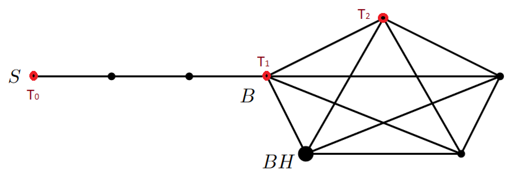

## Problem Statement
Consider the symmetric random walk on the “switch” version of $K_N+P_M$ plus the Blackhole; see Figure 5 in the special case $n=5,m=3$. What is the average travel time from $S$ to BH? Express it in terms of $n$ and $m$. Which one is larger: (13) or the solution of the 6-th Homework?

## Solution
I introduce three "classes" of points here: $T_0$,$T_1$, and $T_2$. The behavior of all the other points in the graph can either be disregarded when writing the recurrence for how this RW evolves, or they are functionally identical to one of these three points.

<!-- \includegraphics[scale=0.4]{SwitchRW.PNG} -->

The following equations model the random walk:
$\begin{align}
  T_0=M^2+T_1 \\
  T_1=\frac{M+N-1}{\frac{1}{M}+N-1}+\frac{\frac{1}{M}}{\frac{1}{M}+N-1}T_0+\frac{N-2}{\frac{1}{M}+N-1}T_2 \\
  T_2=1+\frac{1}{N-1}T_1+\frac{N-3}{N-1}T_2
\end{align}$
Each has a constant term (not dependent on $T_i$). This is the average distance traveled until the next "interesting point" is reached. To be more precise, $S$ and all points on $K_N$ are considered "interesting". Basic case-counting probability and the Inverse Probability Rule are used to weight the chance of the next "interesting" point being each of $T_i$.

Solving the system of equations yields $T_0=M^2+N+4\frac{M}{N}-1$
One interesting takeaway is that the linear section of the RW appears to dominate the travel time. The travel time is quadratic in $M$ but linear in $N$. When $N=M$, this solution is $O(N^2)$ while the pre-switch version of this problem was $O(N^3)$. Thus, when $N=M$, this is an asymptotically faster random walk than the previous one. **QED**.